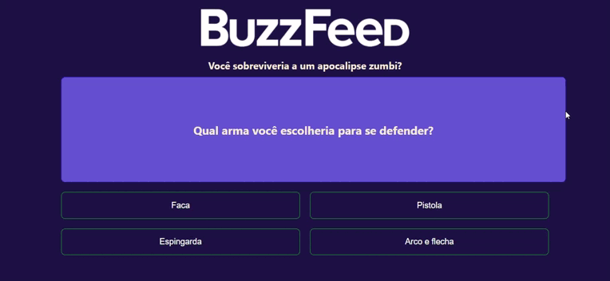

# BuzzFeed - Angular

Aplicação Angular de um quiz interativo que carrega perguntas e respostas de um arquivo JSON, apresenta uma pergunta de cada vez ao usuário, e exibe um resultado final baseado nas respostas escolhidas.

<a href="https://projeto-buzzfeed-rouge.vercel.app">Link para testar o projeto</a>

**Quizz**

## ✔️ Técnicas e tecnologias utilizadas

* Angular 16
* Typescript

## 🤝 Contribuições
* Contribuições são bem-vindas! Sinta-se à vontade para abrir problemas, propor melhorias ou enviar solicitações de pull.

⭐️ Star o projeto

🐛 Encontrar e relatar issues